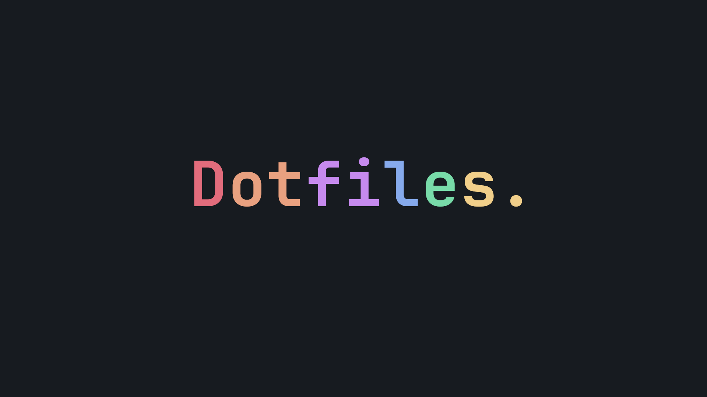
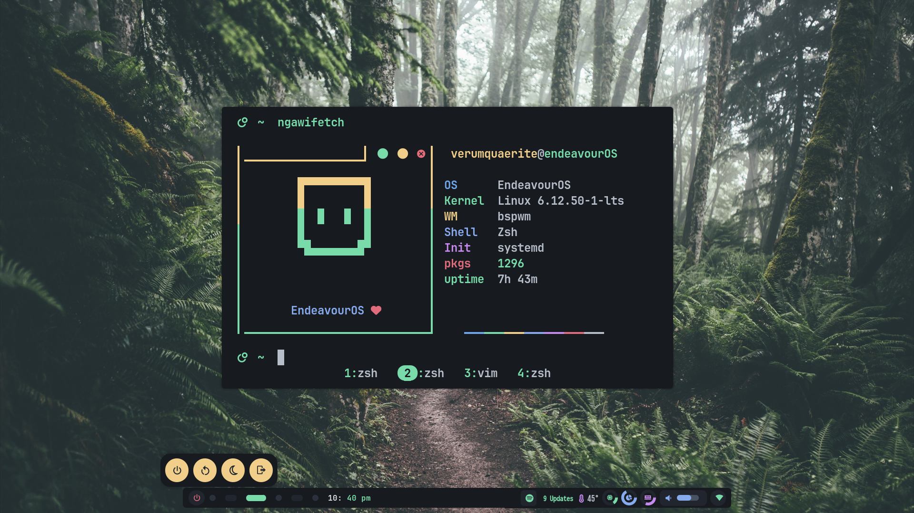
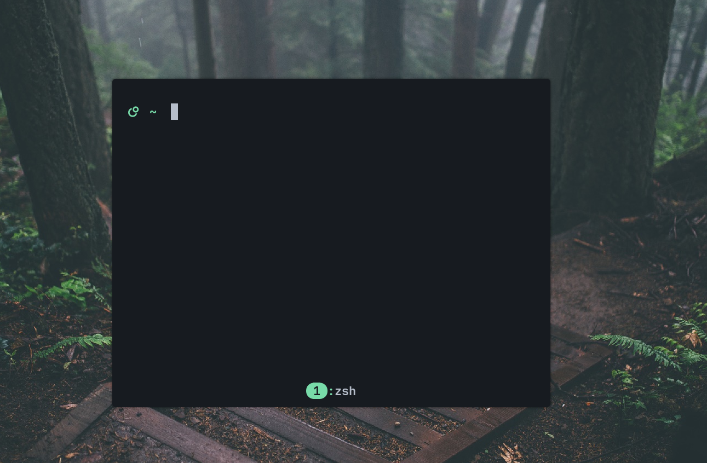

# My bspwm, kitty, starship, and gtk theme config files.

<p align="center">
  <a href="https://github.com/V1337Q/dotfiles/stargazers">
    
  </a>
  <a href="https://github.com/V1337Q/dotfiles/issues">
    
  </a>
</p>


## Preview:


## Features:
- Clean (or not so) Starship prompt and tmux config.

- Polybar + eww widgets (veri cool i swer)
- Picom animations.

- The preview above does not represent the latest picom config. I'm just too lazy to record another preview. Don't worry, it's a lot better that the preview.

## Installation:

**Just clone the repo, and then copy the config files into the correspond app config directory.**

### For the tmux config
**Don't forget to do**
```bash
prefix + I

```
**To install the plugins**

**Don't forget to add these to your bspwmrc file:**

```bash
eww open cpuwin
eww open ramwin
eww open diskwin
eww open tempwin
eww open updateswin
eww open powerwindow
eww open volume-slider-window
eww open volume-button-window
eww open wifi-button-window
eww open music-button-window
```
These are for the eww widgets.


**A little change so that I could push my new nvim config (it wont let me)**
**INSTALL SCRIPT COMING SOON! (imbeingfr)**

# NOTE 
**The picom config sometimes breaks if you change the rice. Don't worry. I'm looking forward to fixing it!**

# Disclaimer !
**I use gh0stzk's autobspwm/rice as a starting point.**
**The rice i use and configure is the cristina one.**
**Check out their repo here: https://github.com/gh0stzk/dotfiles**
